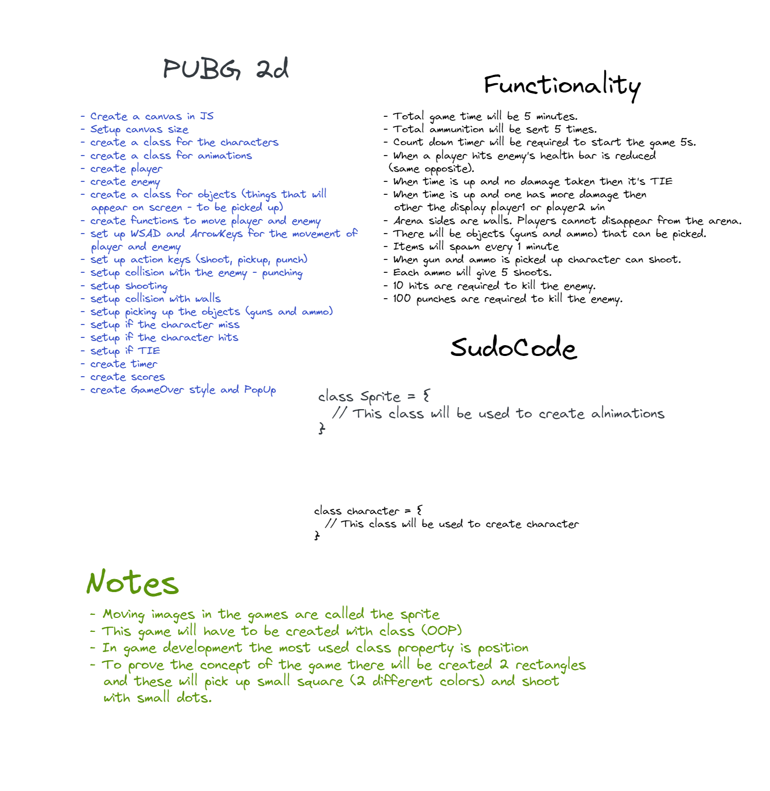

# GA SEI PROJECT 1 - PUBG2d

This is my first solo project, a simple 2d game created using HTML, CSS and JavaScript. The main concept of it is a gunfight between two soldiers.

## Getting started and deployment

- The game has been deployed with the GitHub Pages and it's available [here](<https://mehcanic.github.io/project-1/>)
- There is no installation for this code. Just clone the repo and take a look.
- Player 1 moves with W, S, A, and D keys and shoots with the T key.
- Player 2 moves with arrow keys and shoots with Num 1 key.

## Goal and timeframe

The time frame for the project was 2 weeks. It was an independent project.

## Technologies used

- HTML and HTML Canvas
- CSS
- JavScript
- GitHub

## Brief

- Render a game in the browser
- Design logic for winning & visually display which player won
- Include separate HTML / CSS / JavaScript files
- Stick with KISS (Keep It Simple Stupid) and DRY (Don't Repeat Yourself) principles
- Use JavaScript for DOM manipulation
- Deploy your game online, where the rest of the world can access it
- Use semantic markup for HTML and CSS (adhere to best practices)

## Planning and Development procces

I decided to build an animated 2d game as I was interested in how HTML Canvas works.

- I've used Excalidraw for the planning and task management of this project.



- The first stage was to set up HTML Canvas to see how it works. I started this by creating the canvas tag in index.html.
- Then I added a simple style to see what I was working on.
- After that, I created a class for Player and Player 1 objects to figure out how to move the character.
- To do it, I created “eventListeners” for each specific key for each user on the keyboard as both players will control their characters on the same keyboard.

```JS
window.addEventListener("keyup", (e) => {
  switch (e.key) {
    // Player 1 movement
    case "w":
      player1.keyUp.pressed = false;
      break;
    case "s":
      player1.keyDown.pressed = false;
      break;
    case "a":
      player1.keyLeft.pressed = false;
      break;
    case "d":
      player1.keyRight.pressed = false;
      break;
    case "t":
      player1.keyShoot.pressed = false;
      break;
    // Player 2 movement
    ...
  }
});
```

- By default, these values were set to false. When the user presses the key, the value for keyUp (etc.) will change to true meaning that the user pressed the button. This helped to control character movement in real time.

```JS
  keyUp: { pressed: false },
  keyDown: { pressed: false },
  keyLeft: { pressed: false },
  keyRight: { pressed: false },
  keyShoot: { pressed: false },
```

- In the Player class, I used the method to move the character. Below is part of the function:

```JS
  if (this.keyUp.pressed) {
    this.position.y -= this.speed;
    player.imageSrc = player.sprites.run.imageSrc;
    player.framesMax = player.sprites.run.framesMax;
  }
```

- It is called playerActions() and I used to move the character. This function is called inside the animate() function.

```JS
  player1.playerActions(player1);
  player2.playerActions(player2);
```

- I used the animate function to draw the whole game on the canvas. In this function, I created another function for drawing bullets and checking for collisions with the player.

```JS
const animate = () => {
  ...
  player1.bullets.forEach((bullet) => {
    if (
      bullet.position.x - bullet.radius > canvas.width ||
      player2.isCollision(bullet)
    ) {
      player1.bullets.splice(player1.bullets.indexOf(bullet), 1);
    } else {
      bullet.draw();
      bullet.position.x += bullet.speed;
    }
    player2.bulletCollision(player1.bullets);
  });

  player2.bullets.forEach((bullet) => {
    if (bullet.position.x <= 0 || player1.isCollision(bullet)) {
      player2.bullets.splice(player2.bullets.indexOf(bullet), 1);
    } else {
      bullet.draw();
      bullet.position.x -= bullet.speed;
    }
    player1.bulletCollision(player2.bullets);
  });
};
animate();
```

## Challenges

This was my first project using JavaScript. There were many challenges along the way. One of the biggest was understanding how to use classes in OOP. The second biggest challenge was to create animation for the collision between bullets, players and obstacles on the map. I had to remove obstacles from the game before the deadline as it was breaking the code, mainly the offset of the characters' positions and bullets.

## Wins

The biggest win was when I got into problems with bullets. Bullets, when drawn on the Canvas too many times, were causing the browser to crash. I was able to recreate the whole project within 6-8 hours the day before the deadline. Being able to write and understand the entire project from the start and avoid making the same mistakes was a good feeling.

## Future improvements

This project still has some unresolved issues, such as problems with the positions of the characters and bullets, and obstacles' collisions. Therefore, I have decided to recreate the project using only HTML, CSS, and JavaScript, without the use of HTML Canvas. I plan to utilise the CSS 'grid' property in this new approach, allowing me to create a web browser game using a minimalist code space. This approach will help me achieve a different method of creating a game, enhancing my skills in web development.

## Key learnings

Making my first static JS browser game from scratch was a great learning exercise and a fun way to consolidate my learnings. In particular, I learnt a lot about DOM manipulation, different use cases for different JavaScript array methods, and working with timers.